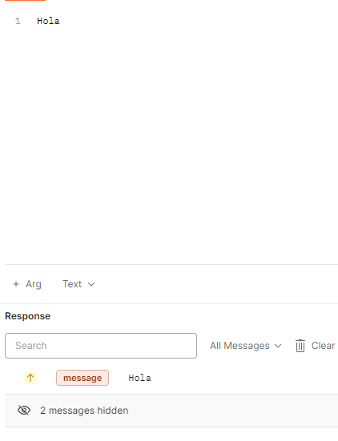

Chat en NestJs usando socket.io y graphQL.

para configurar el proyecto es necesario instalar las dependencias con `npm install` luego procedemos a ejecutar con `npm run start`

a probar como socket en postman (ideal):

en evento debemos subscribirnos al valor que se declaro en el socket ("message")

procedemos a conectarnos:

importante ver la comprobación de que estamos conectados

para la prueba procedemos a conectar dos clientes:

ahora en postman en event tipeamos ("message"): 

  

y procedemos a enviar el mensaje: 

finalmente el otro cliente, verá dicho mensaje con el id del remitente:

ahora para ver el poder de graphQL (accedemos desde el navegador http://localhost:3000/graphql )

y ejecutamos esta mutación: 

mutation {
  sendMessage(content: "Hola GraphQL") {
    status
  }
}

recibiendo el mensaje:
{
  "data": {
    "sendMessage": {
      "status": "Mensaje enviado: \"Hola GraphQL\""
    }
  }
}

y esto lo recibimos de esta forma, con los clientes que estaban en postman conectados

a probar como websocket en postman: 
ws://localhost:3000/socket.io/?EIO=4&transport=websocket

ws://	Indica que es una conexión WebSocket (no HTTP)
localhost:3000	Dirección y puerto de tu servidor NestJS
/socket.io/	Ruta base que Socket.IO usa para sus conexiones
?EIO=4	Engine.IO v4 (versión del protocolo interno de Socket.IO)
&transport=websocket	Fuerza el uso de WebSocket puro (sin fallback a HTTP largo-polling)
